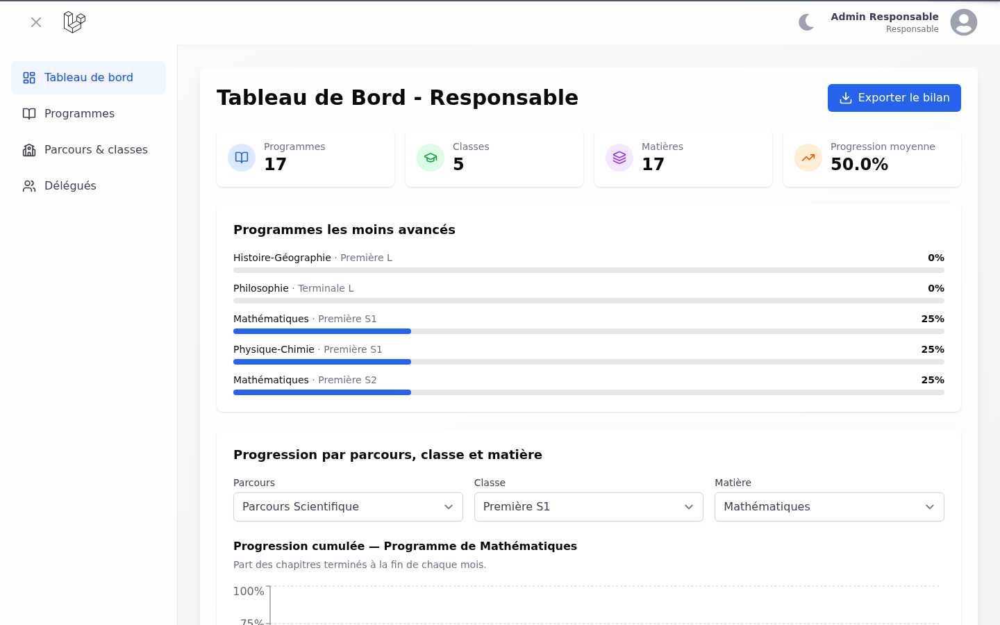

# SuiviApp — suivi de progression des cours

SuiviApp tracks how far each class has progressed through each subject's syllabus.

- **Délégués** (class representatives) log what was covered after every lesson.
- **Responsables** (pedagogical coordinators) follow progression in real time, spot the programmes that are falling behind, and export a PDF report per programme.

> Case study: [`docs/case-study.md`](docs/case-study.md)



## Features

**Responsable**
- Dashboard with:
  - KPI tiles;
  - the least-advanced programmes;
  - a Parcours → Classe → Matière drill-down;
  - a cumulative monthly progression chart.
- Programme browser with search and filters.
  - Each chapter shows every report logged against it.
- Programme editor to rename a programme, add or remove chapters, and mark chapters finished or reopen them.
  - Each change is timestamped for the timeline.
- Parcours → classes → subjects management. Creating a subject also creates its programme.
- Délégué accounts: approve new sign-ups, suspend an account, or reject a pending registration.
- "Bilan du programme" PDF export (DomPDF).

**Délégué**
- Sign up by choosing a class, then wait for a responsable's approval.
- Class dashboard with progress per subject.
- Log a lesson report (subject → chapter, date, notes). The chapter can optionally be marked finished.
- Edit or delete your own reports. A report is only possible on chapters of your own class.

## Stack

| Layer | Tech |
| --- | --- |
| Backend | Laravel 11 (PHP ≥ 8.2), Breeze auth, Inertia v2 |
| Frontend | React 18, TypeScript, Tailwind CSS, shadcn/ui (Radix), Recharts |
| PDF | barryvdh/laravel-dompdf |
| Tests | Pest (feature tests on in-memory SQLite) |
| CI | GitHub Actions: Pint, Pest, migrations, ESLint, `tsc`, Vite build |

## Data model

```
Parcours ─< Classe ─< Matière ── Programme ─< Chapitre ─< Activité
                 └─< User (role: responsable | delegue)
```

Progression = finished chapters / total chapters. The monthly series is cumulative and computed from `chapitres.finished_at` by `app/Services/ProgressionService.php`. The dashboards and the PDF export all use this one service.

## Getting started

```bash
composer install
npm ci
cp .env.example .env
php artisan key:generate
touch database/database.sqlite
php artisan migrate:fresh --seed
composer dev        # serves the app, queue worker, logs and Vite
```

Demo accounts (password `password`):

| Email | Role |
| --- | --- |
| `responsable@example.com` | Responsable |
| `delegue@example.com` | Délégué, Première S1 |
| `delegue2@example.com` | Délégué, Première S2 |
| `delegue3@example.com` | Délégué, pending approval |

## Quality checks

```bash
php artisan test            # Pest
vendor/bin/pint --test      # PHP code style
npx eslint resources/js --ext .ts,.tsx
npm run build               # tsc + Vite (client and SSR)
```

## Security model

- Role gates (`responsable`, `delegue`) apply on every route group.
- Self-registered accounts are always délégués and need approval. The `approved` middleware enforces this.
- `ActivitePolicy` checks:
  - a délégué can only report on chapters of their own class;
  - only the author can edit or delete a report.
- A programme update only accepts chapter ids that belong to that programme.
