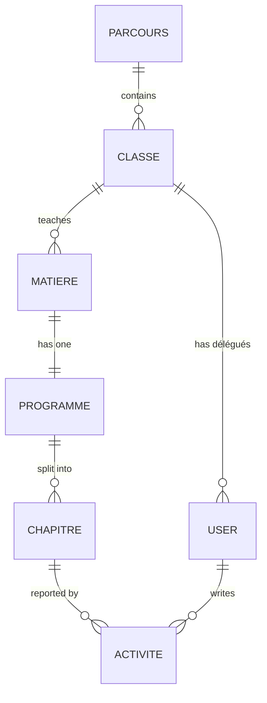
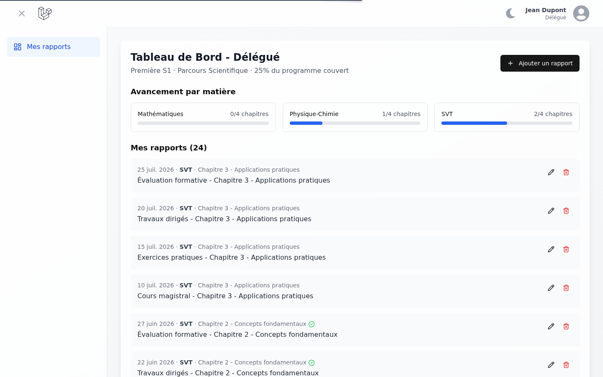
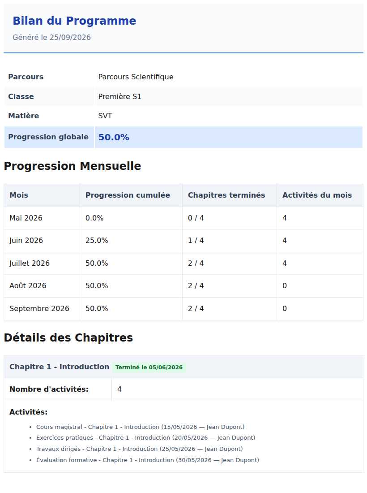

# Case study: SuiviApp, from prototype to working product

**Role:** full-stack developer (Laravel, React/TypeScript), owner of the project
**Timeline:** prototype built in January 2025; audit and rebuild in September 2026
**Stack:** Laravel 11 · Inertia v2 · React 18 + TypeScript · Tailwind/shadcn · Recharts · DomPDF · Pest · GitHub Actions
**Repository:** `machut-rgb/suivi-cours`

> **Résumé (FR).** SuiviApp permet à un responsable pédagogique de suivre l'avancement des programmes par parcours, classe et matière, à partir des rapports saisis par les délégués après chaque cours.
>
> Parti d'un prototype dont seul l'affichage fonctionnait, j'ai audité le code, corrigé le schéma de données, implémenté le parcours délégué et les écrans de gestion, et fermé quatre failles d'autorisation. J'ai aussi remis en route la CI. Résultat : 63 tests au vert au lieu de 1 sur 25, 0 erreur TypeScript au lieu de 51, et un build qui passe.

---

## 1. The problem

In a French lycée, a **responsable pédagogique** has to know, for each class and subject, how much of the official syllabus has actually been taught. Until now, that information lived in teachers' notebooks and in informal conversations with class **délégués** (student representatives).

The idea behind SuiviApp:

1. Délégués log a short report after each lesson: which chapter was covered, and what was done.
2. The syllabus is modelled as programmes made of chapters, and a chapter is marked finished when it is completed.
3. The responsable gets a live dashboard: overall progress, the programmes falling behind, a monthly timeline, and a PDF report per programme to share with the teaching team.

## 2. Starting point: an honest audit

The January 2025 prototype looked finished: dashboards, charts and a PDF export. In practice, only the **read** side worked. Before changing anything, I set up the project from scratch and measured it.

| Check | Result |
| --- | --- |
| `php artisan test` | **1 / 25 passing** (every failure: `NOT NULL constraint failed: users.classe_id`) |
| `npm run build` (`tsc && vite build`) | **fails**, 51 TypeScript errors |
| CI workflow | could never pass: PHP 8.0 against a `^8.2` lockfile, and it only ran on `main` while work happened on `develop` |
| Migrations | only worked on SQLite: tables referenced foreign keys of tables created *later* |

A code review then showed the core workflow was missing:

- **The délégué side did not exist.** The dashboard was a static page and its "Ajouter un rapport" button did nothing. `ActiviteController` referenced columns and relations that didn't exist (`programme_id`, `chapitre_aborde`, `->programme`), so every endpoint would have failed. I established this by reading the code, since the UI never called it. All the data on screen came from the seeder.
- **Progress could not change.** The programme editor sent an `isFinished` flag, but the controller never saved it.
- **Management screens called routes that didn't exist:**
  - parcours create/edit/delete, and délégué approve/reject returned 404;
  - class creation dropped a required column;
  - `Route::resource('classes')` bound `{class}` while the controller expected `$classe`, so edits ran against an empty model and silently did nothing.
- **Some metrics were wrong:**
  - the "Matières" KPI actually counted classes;
  - the "monthly progression" was derived from `updated_at`, which changes on any edit.

## 3. What I changed

### 3.1 Data integrity first

- Reordered the migrations so each table is created after the tables it depends on: parcours → classes → matières → programmes → chapitres → activités.
- Moved `users.classe_id` into its own migration. It is now nullable with `nullOnDelete`; the original `NOT NULL` combined with `SET NULL` is invalid on MySQL.
- Added the columns the product actually needs:
  - `chapitres.finished_at`, kept in sync by a model hook, so progression has a real timeline;
  - `activites.date`, the date of the lesson rather than the date of data entry;
  - `users.approved_at`.
- Wrote factories for every model and a seeder with a realistic four-month history.

**Outcome:** the existing test suite went from 1/25 to 25/25 before any feature work.

### 3.2 One source of truth for progression

The same percentage was computed three different ways: in the dashboard, on the programmes page and in the PDF. I moved it into `ProgressionService`:

- `percentage()` returns finished chapters divided by total chapters;
- `monthly()` returns a **cumulative** series built from `finished_at`, with the number of activities per month.

The dashboards and the PDF now always agree, and the logic is unit-tested with fixed dates.

### 3.3 The délégué workflow (the actual product)

- Sign-up now asks for the délégué's class. The account is created as `delegue` with `approved_at = null`.
- An `approved` middleware keeps the account on a "pending approval" page until a responsable validates it.
- The délégué dashboard shows:
  - progress per subject for their class;
  - a report form (subject → chapter, date, notes, optional "chapter finished");
  - their own reports, with edit and delete.

### 3.4 Responsable tooling

- **Programme editor:** one `PUT` request validated by a FormRequest and wrapped in a transaction handles renaming, adding and removing chapters, and marking chapters finished or reopening them.
- **Parcours → classes → subjects:** a single tree page with working CRUD. Creating a subject also creates its programme.
- **Délégués:** approve, suspend, or reject. Reject refuses accounts that already have reports, because the delete would cascade.
- **Dashboard:** corrected KPIs, a "least advanced programmes" list (what a coordinator actually acts on), and a cumulative chart.
- **PDF report:** built on the shared service, with French month names and who reported what, and when.

## 4. Security findings and fixes

I treated authorisation as a first-class deliverable, and each fix is pinned by a test.

| # | Finding | Impact | Fix |
| --- | --- | --- | --- |
| 1 | **IDOR on chapter ids.** The programme update loaded chapters with `Chapitre::find($id)` for any id in the payload. | A responsable editing programme A could rename, close or delete chapters of programme B. | Ids are checked against the programme's own chapters, and a foreign id rejects the whole request with a 422. |
| 2 | **Open self-registration.** Anyone could register and land in the app as a délégué. | Any stranger could post reports and move a class's progression. | A class is required at sign-up, and a responsable must approve the account (`approved` middleware). `role` and `approved_at` sent in the payload are ignored. |
| 3 | **Missing report ownership and class scope.** | Once the feature worked, any délégué could have reported on, or edited, another class's chapters. | `ActivitePolicy`: create only on chapters of your own class; update and delete only by the author; a report cannot be moved to another class. |
| 4 | **Guard by design on the new délégué endpoints.** The approve, suspend and reject endpoints take a user id. | Without a guard, they could be pointed at a responsable account. | They return 404 unless the target is a délégué, and reject refuses accounts that have reports. |

I **mutation-checked** the security tests: removing the guard in the controller or policy makes the corresponding test fail.

## 5. Results

| Metric | Before | After |
| --- | --- | --- |
| Automated tests | 1 / 25 passing | **63 / 63 passing** (228 assertions) |
| TypeScript errors | 51 | **0** |
| `npm run build` | failing | **passing** (client + SSR) |
| CI | could never install dependencies | Pint, Pest, migrate + seed, ESLint, `tsc`, Vite build on `main` and `develop` |
| Core user journeys working end to end | 1 of 3 (read-only dashboard) | **3 of 3**: délégué reports, responsable manages and monitors, PDF export |

End-to-end verification: a Playwright script drives both roles in Chromium through every journey:

1. A délégué logs a report and closes a chapter.
2. A pending délégué is held at the approval page.
3. The responsable sees the report and moves progression from 25% to 50% in the editor.
4. The responsable exports the PDF.
5. The responsable creates a parcours, a class and a subject.
6. The responsable approves the pending délégué.

## 6. Decisions and trade-offs

- **Reordering migrations instead of adding fix-up migrations.** The app had no production database, so a clean, readable schema history was worth more than migration continuity. On an app with a live database I would have added corrective migrations instead.
- **A délégué can close a chapter but not reopen it.** Closing is the natural result of reporting a lesson. Reopening is a correction, so it stays with the responsable.
- **Server-computed progression.** The client now only renders. This removed duplicated logic and made the numbers testable.
- **Kept the scope tight.** I left out notifications, multi-establishment support and teacher accounts, and noted them in the roadmap rather than half-building them.

## 7. What I'd do next

- Notify the responsable (e-mail or in-app) when a délégué registers or a programme stalls.
- Import the official syllabus (chapters) from a CSV per subject.
- Planned vs actual pacing: expected chapter dates, so "late" becomes measurable rather than relative.
- A MySQL/PostgreSQL job in CI, since the ordering fix is currently only exercised on SQLite in CI.

## 8. How this was built

I built the original prototype in January 2025. I ran the September 2026 audit and rebuild with an AI coding assistant (Claude Code), directing the scope, reviewing the changes and validating the results. Every claim above can be checked against the commit history and test suite on the `develop` branch.
